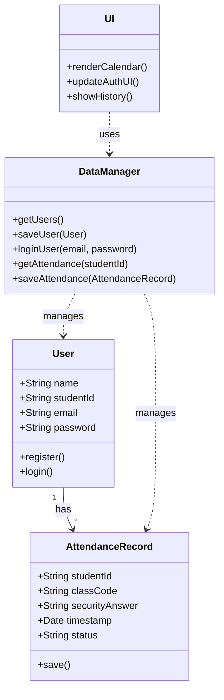

# SATS UML Diagrams

## Use Case Diagram

```mermaid
usecaseDiagram
    actor Student
    actor Instructor
    actor Admin

    package SATS {
        usecase "Register" as UC1
        usecase "Login" as UC2
        usecase "Check-in Attendance" as UC3
        usecase "View Attendance History" as UC4
        usecase "View Calendar" as UC5
        usecase "Contact Support" as UC6
    }

    Student --> UC1
    Student --> UC2
    Student --> UC3
    Student --> UC4
    Student --> UC5
    Student --> UC6
    
    %% Note: Instructor and Admin are implied for generating codes/reports, 
    %% but the current system focuses on the Student interface.
```

## Class Diagram


